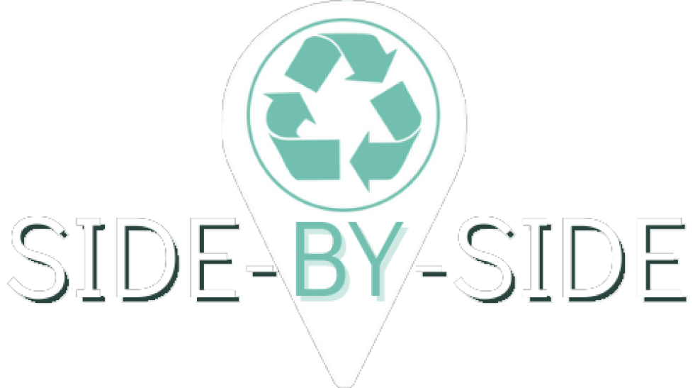

 
	
	<h1>Side by Side</h1>

 
	

  Projeto desenvolvido com o objetivo de praticar a criação de interfaces em equipe usando React e Typescript. Trata-se de um sistema que objetiva reunir informações de pontos de coleta seletiva espalhados pelo mundo a fim de facilitar uma parte do processo de realização de coleta pelos cidadãos que é a busca por pontos na cidade. Além disso, permite que os usuários marquem pontos que ainda não estejam no mapa e, também, podem marcar eventos ecológicos como, por exemplo, limpeza em alguma praia. E, dessa forma, outros usuários podem visualizar e optar por participar desse eveto.  

<h3> ⚙️ Funcionamento </h3>

  A base do projeto é um mapa, tipo Google Maps. Nele, serão marcados, inicialmente, os principais pontos de coleta do Brasil e, posteriormente, os usuários poderão marcar outros pontos que não estejam no sistema além da marcação dos eventos. Por exemplo: Kenzinho Ecológico quer marcar uma limpeza de praia para o próximo sábado, dia 11. Ele preenche o formulário com o endereço, nome, descrição e horário da limpeza e a marcação ocorrerá no mapa. Bastando que outros usuários visualizem o evento, cliquem no botão “Participar” e compareçam ao local no dia e horário combinado. 
Ademais, ainda terá uma gamificação do sistema a fim de estimular as ações das pessoas. Os usuários terão quantitativos que os farão subir de nível, como conquistas e locais visitados. 

<h3> 🚀 Tecnologias utilizadas </h3> 

	
Frontend

	
   - React
   - Typescript
   - Javascript
   - Chakra UI
   - Framer motion
   - Emotion
   - React Icons
   - Axios 
   - JWT-Decode
   - React Hook Form
   - React Router Dom
   - React Google Maps
   - React Scroll Parallax

	
Backend

   - Google Maps API
   - [Backend fake feita pelo grupo no JSON Server](https://capstone-group2.herokuapp.com/)

<h3> 💻 Desenvolvedores </h3>

 
  <a href="https://www.linkedin.com/in/ayana-mello/">Ayana Mello</a>
  | <a href="https://www.linkedin.com/in/gabriel-bueno-11227a209/">Gabriel Bueno</a>
  | <a href="https://www.linkedin.com/in/lucas-bravo-rozado-a80b36213/">Lucas Bravo Rozado</a>
  | <a href="https://www.linkedin.com/in/mgavadev/">Mateus Gava</a>
  | <a href="#">Victor Martins</a>

